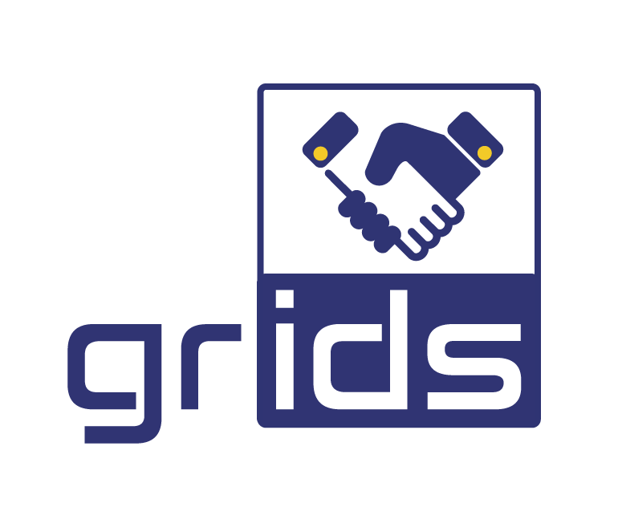

<!-- PROJECT LOGO -->
<br />
<div align="center">
  <a href="https://project-grids.eu">
    
  </a>

<h3 align="center">SDK for Project GRIDS</h3>

  <p align="center">
    increasinG tRust with eId for Developing buSiness
    <br />
    <a href="/"><strong>Explore the docs »</strong></a>
    <br />
    <br />
    <a href="">View Demo</a>
    ·
    <a href="/issues">Report Bug</a>
    ·
    <a href="/issues">Request Feature</a>
  </p>
</div>


<!-- TABLE OF CONTENTS -->
<details>
  <summary>Table of Contents</summary>
  <ol>
    <li>
      <a href="#about-the-project">About The Project</a>
    </li>
    <li>
      <a href="#getting-started">Getting Started</a>
      <ul>
        <li><a href="#prerequisites">Prerequisites</a></li>
      </ul>
    </li>
    <li><a href="#usage">Usage</a></li>
  </ol>
</details>


<!-- ABOUT THE PROJECT -->
## About The Project

The purpose of GRIDS Software development kit is to offer Data Consumer (DC) a quick and straightforward way to implement and consume GRIDS API services.

GRIS SDK uses JAVA as its main language and a JAR package file is generated and shared with the Data Consumers.
The main purpose of the SDK is providing a set of interfaces, models and services(wrappers) following OpenID Connect, Identity Assurance and eKYC specifications that the DC can use in order to connect and consume GRIDS API endpoints.

<p align="right">(<a href="#top">back to top</a>)</p>


<!-- GETTING STARTED -->
## Getting Started


### Prerequisites

* JDK 8+ <br/> https://www.oracle.com/java/technologies/downloads/


<!-- USAGE EXAMPLES -->
## Usage

1. First step is to use GRIDSClientManager to register a new client with DCC and receives a client id and a client_secret. That can be achievent by calling registerClient and passing all required parameters, example: name, DC JWKS enpoint, callback url, etc.

    ```java
    URI dcc_Url = new URI("http://vm.project-grids.eu:8082/auth/realms/grids/");
   
    GRIDSIssuer issuer = new GRIDSIssuer(dcc_Url);
    OIDCProviderMetadata metadata = issuer.getOPMetadata();
    GRIDSClientManager gridsClientManager = new GRIDSClientManager(metadata.getRegistrationEndpointURI());
   
    OIDCClientMetadata clientMetadata = new OIDCClientMetadata();
    clientMetadata.setName("Adacom test");
    clientMetadata.setGrantTypes(Collections.singleton(GrantType.AUTHORIZATION_CODE));
    clientMetadata.setRedirectionURI(new URI("https://example.ex/callback"));
    clientMetadata.setJWKSetURI(new URI("https://example.ex/jwks"));
    clientMetadata.setUserInfoJWEAlg(JWEAlgorithm.RSA_OAEP_256);
    clientMetadata.setUserInfoJWEEnc(EncryptionMethod.A128CBC_HS256);
    clientMetadata.setUserInfoJWSAlg(JWSAlgorithm.RS256);
    
    ClientInformation clientInformation = gridsClientManager.registerClient(clientMetadata, masterToken);
    
    String clientId = clientInformation.getID().getValue();
    String clientSecret = clientInformation.getSecret().getValue();
    ```

2. Initialize a GRIDSIssuer using the GRIDS endpointUrl, client_id, client_secret, callbackUrl and JWKS keyPair. After initialization DC can request BAA configuration using getOPMetadata method in order to retrieve all required metadata in order to continue.
    ```java
    KeyPairGenerator gen = KeyPairGenerator.getInstance("RSA");
    gen.initialize(2048);
    KeyPair keyPair = gen.generateKeyPair();
    
    URI dcc_Url = new URI("http://vm.project-grids.eu:8082/auth/realms/grids/");
    URI callbackURI = new URI("https://example.ex/callback");
    
    GRIDSIssuer gridsIssuer = new GRIDSIssuer(dcc_Url, "client_id", "client_secret", callbackURI, keyPair);
    ```
    Metadata Example
    ```java
    OIDCProviderMetadata opMetadata = gridsIssuer. getOPMetadata();
    
    //Read metadata example
    URI issuer = metadata.getIssuer(); // ex "https://DCC.example.com"
    URI authorizationURI=op.getAuthorizationEndpointURI()// https://BAA.example.com/connect/authorize
    URI tokenURI = op.getTokenEndpointURI() // https://DCC.example.com/connect/token
    List<String> st =  metadata.getSubjectTypes() // ["public", "pairwise"]
    URI jwks = metadata.getJWKSetURI() // https://BAA.example.com/jwks.json
    Boolean svc = metadata.supportsVerifiedClaims() // true
    List<String> itf = metadata.getIdentityTrustFrameworks() // ["eidas_ial_substantial", "eidas_ial_high"]
    List<String> idt = metadata.getIdentityDocumentTypes() // ["idcard", "passport"]
    List<String> ivm = metadata.getIdentityVerificationMethods() // ["pipp", "sripp", "eid"]
    List<String> vcs = metadata.getVerifiedClaims() // ["given_name", "family_name", "birthdate", "place_of_birth", "nationality", "address"]
    ```

3. Call ```getAuthorizationUrl``` passing all the request claims as a parameter. Doing so, a url will be returned. Using this url redirect Users browser in order to complete register or login with GRIDS.

    ```java
    JSONObject type = new JSONObject();
    type.put("value", "company_register");

    JSONObject registry = new JSONObject();
    JSONObject organisation = new JSONObject();
    JSONObject country = new JSONObject();

    organisation.put("essential", false);
    organisation.put("purpose", "string");

    country.put("essential", true);
    country.put("purpose", "string");
    country.put("value", "AT");

    registry.put("organisation", organisation);
    registry.put("country", country);

    JSONObject evidence = new JSONObject();
    evidence.put("type", type);
    evidence.put("registry", registry);

    JSONArray evidence = new JSONArray();

    evidence.add(evidence);

    JSONObject verification = new JSONObject();
    verification.put("trust_framework", "grids_kyb");
    verification.put("userinfo_endpoint", "https://dp.example.com:8050/userinfo");
    verification.put("evidence", evidence);


    JSONObject idVerification = new JSONObject();
    idVerification.put("trust_framework", "eidas");

    List<VerifiedClaimsSetRequest> userInfoVerifiedList = new ArrayList<>();

    userInfoVerifiedList.add(new VerifiedClaimsSetRequest()
            .withVerificationJSONObject(verification)
            .add("family_name")
            .add("given_name")
            .add("birthdate")
            .add("legal_name")
            .add("legal_person_identifier")
            .add("lei")
            .add("vat_registration")
            .add("address")
            .add("tax_reference")
            .add("sic")
            .add("business_role")
            .add("sub_jurisdiction")
            .add("trading_status"));

    OIDCClaimsRequest claims = new OIDCClaimsRequest()
            .withIDTokenVerifiedClaimsRequest(
                    new VerifiedClaimsSetRequest()
                            .withVerificationJSONObject(idVerification)
                            .add("family_name")
                            .add("given_name")
                            .add("birthdate")
                            .add("person_identifier")
                            .add("place_of_birth")
                            .add("address")
                            .add("gender")
            )
            .withUserInfoVerifiedClaimsRequestList(userInfoVerifiedList);


    String url = gridsIssuer.getAuthorizationUrl(claims);
    ```

4. After user successfully logins or registers, DCs callbackUrl will be triggered. Passing that into GRIDSIssuer requestToken will request from DCC and return an Access token.
Example with Springboot
    ```java
    @RequestMapping(value = "callback")
    public String callback(HttpServletRequest request, HttpServletResponse response, Model model) {
    
        //rebuild request url
        String requestUrl = requestURL.append('?').append(request.getQueryString()).toString();
    
        OIDCTokens tokens = gridsIssuer.requestToken(requestUrl);
    
        if (tokens == null) {
            //TODO: Error check logs
        }
    
        String accessToken = tokens.getAccessToken().getValue();
        String idToken = tokens.getIDTokenString();
    }
    ```

5. Request UserInfo to get distributed claims.
    ```java
    UserInfo userInfo = gridsIssuer.getUserInfo(tokens.getAccessToken().getValue());
    Set<DistributedClaims> set = userInfo.getDistributedClaims();
    if (set == null) {
        //TODO: Error check logs
    }
    ```

6. Request Data Provider (DP) userinfo
    ```java
    List<VerifiedClaimsSet> verifiedClaims = new ArrayList<>();
   
    for (DistributedClaims claims : set) {
    
        URI dpEndpoint = claims.getSourceEndpoint();
        String dpToken = claims.getAccessToken().toString();

        UserInfo dpUserInfo = gridsIssuer.getDPUserInfo(dpEndpoint, dpToken);
    
        if (dpUserInfo != null) {
            verifiedClaims.addAll(dpUserInfo.getVerifiedClaims());
        } else {
            //TODO: Error check logs
        }
    }
    ```

<p align="right">(<a href="#top">back to top</a>)</p>